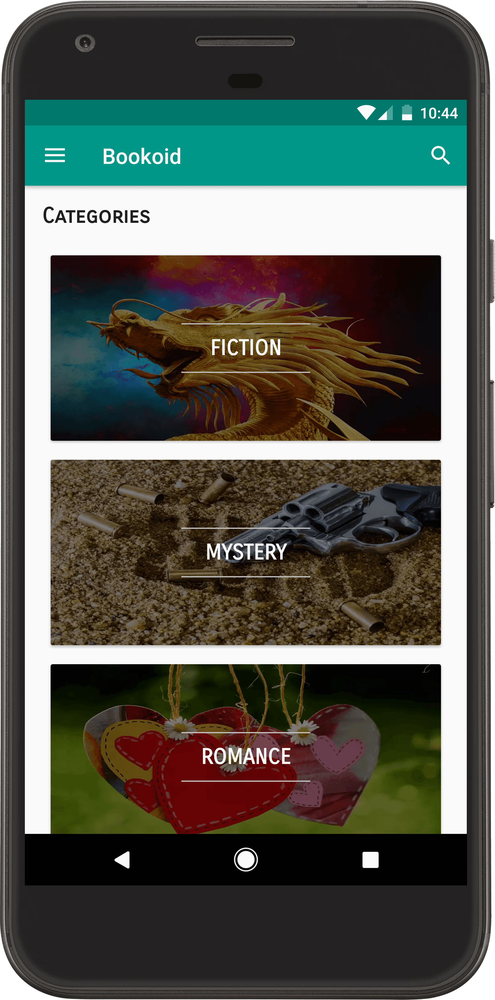
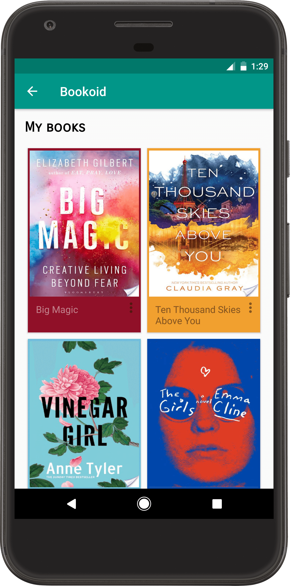
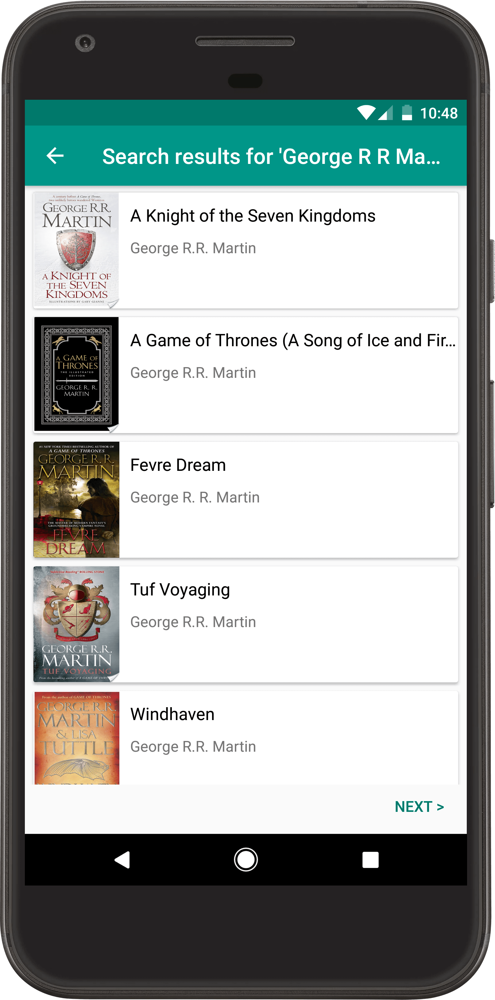
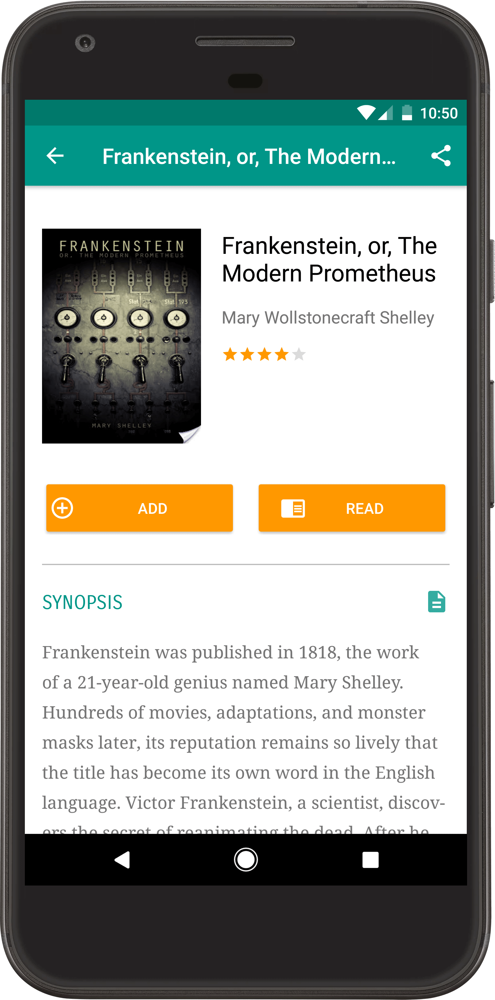

# Bookoid

Bookoid helps you select from a vast collection of books and easily manage your personal books library. Easily find the the book you want and also explore from a range of book listings. Build your library as you discover great books on the app.

## Features

* Search among thousands of books, from bestsellers to classics from authors around the globe
* Explore new books from your favorite categories
* Check description and information of books and also download covers if you like them
* Read entire books when available in public domain
* Search using only emojis
* Preview chapters from books to help find your next great read
* Scan barcode on books to get all the detailed information about it
* Download public domain books for reading offline
* Manage your personal library
* Search for your favorite authors and get all of their books
* Sync your library across all your devices so you can access your books everywhere
* Clean and smooth user interface
* App shortcuts (Android 7.1+)

## Screenshots

### Contact: [saurabhthorat95@gmail.com](mailto:saurabhthorat95@gmail.com)
